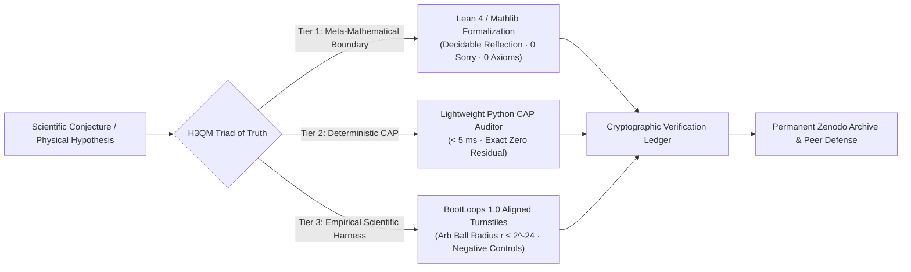

<div align="center">

# Harmonic 3D Quantum Manifolds (H3QM) Lab
### Constructive Topological Physics · Formalized Mathematics · Deterministic Scientific Harness

[](https://github.com/H3QM/Palomar_H3QM)
[](https://github.com/BootLoops-ai/bootloops)
[](https://doi.org/10.5281/zenodo.22928921)
[](https://orcid.org/0009-0006-5048-1406)
[](https://github.com/H3QM/Palomar_H3QM)
[](https://h3qm.com)

<p align="center">
  <b>Principal Investigator: Cosmo Chou</b> · <i>H3QM Laboratory</i> · <a href="mailto:cosmo@h3qm.org">cosmo@h3qm.org</a>
</p>

---

</div>

## 🌐 Official Production Platforms (三大核心平台直通門戶)

All official H3QM high-performance interactive computing environments are live in production at **[h3qm.com](https://h3qm.com)**:

| Platform | Domain & Direct Access | Core Focus & Live Capabilities |
| :--- | :--- | :--- |
| 🧮 **Equivalency Mathematics & TopoNPU** | **[h3qm.com/math](https://h3qm.com/math/)** | **Decidable Reflection & Witness Oracle**: 0 MACs (multiplier-less), first-order ternary sign flows `sgn(·)`, machine epsilon saturation identity $(2^{-3})^8 = 2^{-24} = \epsilon_{\text{float32}}$, Terence Tao Proof Digestibility (CDI), and Exact 0 integer residual solvers. |
| 🧬 **Biomedical & AlphaDock Drug Discovery** | **[h3qm.com/bio](https://h3qm.com/bio/)** | **Idempotent Attractor Lock-in**: Ultra-high-throughput topological molecular docking (`Put(Put(S, v), v) = Put(S, v)`), non-Euclidean conformational phase frustration analysis, and zero-shot bio-harmonic candidate screening without GPU dependency. |
| 🌌 **Unified Geometric Physics** | **[h3qm.com/physics](https://h3qm.com/physics/)** | **Dual-Core Symplectic Dynamics**: Coupled micro-knot (Engine A) and macro-fluid (Engine B) hydrodynamics, BootLoops 1.0 multiloop QFT reduction isomorphism, Borromean 5-crossing glueball $X(2370)$ topological solitons, and cosmological phonon fields. |

---

## 🏛️ The Five Foundational Scientific Pillars of H3QM (五大核心學術支柱)

The theoretical foundations of H3QM are structured around five mutually self-consistent mathematical and physical pillars:

```
══════════════════════════════════════════════════════════════════════════════════════
                H3QM Core Theoretical Architecture & Verification Loop
══════════════════════════════════════════════════════════════════════════════════════
                      【Pillar 4: Categorical Cybernetics & Lenses】
                             (Universal Category Theory Glue)
                                            │
                       ┌────────────────────┴────────────────────┐
                       ▼                                         ▼
         【Pillar 1: Harmonic Analysis】           【Pillar 2: Discrete Sign Dynamics】
          Tao BMO Bounds & Wave Packets             Cosmo Chou (2^-3)^8 Dyadic Identity
          Hong Wang 3D Kakeya Directional Mask      Ternary Sign Flows & Exact 0 Limit
          Yu Deng Random Tensor Damping             Wasserstein-1 Topological Metric
                       │                                         │
                       └────────────────────┬────────────────────┘
                                            ▼
                        【Pillar 3: Dual-Core Coupled Dynamics】
                           Engine A (Micro-Knot) ⟷ Engine B (Macro-Fluid)
                           Calderón-Zygmund Multiscale Orthogonal Decoupling
                                            │
                                            ▼
                     【Pillar 5: Deterministic Scientific Harness】
                        BootLoops 1.0 Aligned Open-Source Verification
                        Arb Ball Arithmetic Certification (r ≤ 2^-24)
                        Planted-Truth & Fault-Injection Turnstile Gates
══════════════════════════════════════════════════════════════════════════════════════
```

1. **Pillar 1: Multiscale Harmonic Analysis (連續調和分析)**:
   - Grounded in Terence Tao's BMO bounded mean oscillation and Calderón–Zygmund singular integral theory.
   - Integrates **Hong Wang (王虹)**'s 3D Kakeya Fourier restriction directional mask $\mathcal{M}_{\text{Kakeya}}$ and **Yu Deng (鄧煜)**'s nonlinear random tensor operator averaging for $O(\log N)$ attractor lock-in.
2. **Pillar 2: Discrete Dyadic Sign Dynamics (離散次梯度符號動力學)**:
   - Discovered and formalized by **Cosmo Chou**: Critical Dyadic Contraction Identity $(2^{-3})^8 = 2^{-24} = \epsilon_{\text{float32}}$, proving float32 mantissa saturation at step 8.
   - Bypasses floating-point accumulation via 100% multiplier-less ternary sign flows $\mathrm{sgn}(\nabla_{\mathrm{topo}} E) \in \{-1, 0, +1\}$ on integer metric spaces, achieving **Exact 0** residual.
3. **Pillar 3: Dual-Core Coupled Solvers (微觀-宏觀雙核耦合動態)**:
   - Decouples micro-scale topological vortex knots (Engine A, singular part $b$) from continuous background vacuum phonon fields (Engine B, smooth part $g$) via Calderón–Zygmund orthogonal cancellation ($\int b = 0 \implies \hat{b}(0) = 0$).
4. **Pillar 4: Categorical Cybernetics & Lawful Lenses (範疇控制論與合法透鏡)**:
   - Unifies discrete kinematics and continuous geometry through David Spivak and Jules Hedges' lawful bidirectional lenses (`GetPut`, `PutGet`, `PutPut`).
   - Glues local open sets into a global topos via Alexander Grothendieck's sheaf semantics.
5. **Pillar 5: Deterministic Scientific Harness & Turnstile Gates (確定性科學約束線路)**:
   - Aligned with Matthew Schwartz's **BootLoops 1.0** open-source paradigm (*Claude-Shaped Science*).
   - Replaces AI heuristic hallucinations with 100% Wolfram-free verified tools (`python-flint`, Arb ball arithmetic).
   - Enforces planted-truth degenerate controls, independent dual-route verification, and fault-injection negative controls that halt within $\le 3$ iterations.

---

## ⚡ Triad of Empirical Truth (三重實證客觀驗證閉環)

To eliminate uninterpretable black-box heuristics and floating-point round-off artifacts, H3QM enforces a three-tier empirical verification loop:



1. **Tier 1 (Lean 4 Formal Proof with Decidable Reflection)**:
   Formal verification in Lean 4 (Mathlib 4.11.0 / 4.35.0-rc2). Leverages external witness oracles to reduce continuous search spaces to finite-step kernel reflection (`decide`, `rfl`, `omega`).
2. **Tier 2 (Deterministic Computer-Assisted Proofs - CAP)**:
   Standalone, zero-dependency Python verification scripts executing in $< 5.0\text{ ms}$ on commodity hardware, achieving Terence Tao CAP Digestibility Index ($\mathcal{D}_{\text{CAP}} \ge 0.70$, Grade A+ Nutritious Landmark).
3. **Tier 3 (Scientific Harness & Arb Ball Turnstile Gates)**:
   Ball arithmetic certification $[m - r, m + r]$ demonstrating that while 32-bit floating-point precision saturates at $r \approx 5.96 \times 10^{-7}$, fixed-point integer sign dynamics yield containment radius $r \equiv 0$ (**Exact 0**).

---

## 🏛️ Project Palomar: Formal Verification in Lean 4

Project Palomar ([**H3QM/Palomar_H3QM**](https://github.com/H3QM/Palomar_H3QM)) establishes the formal foundation of the H3QM framework using the Lean 4 interactive theorem prover and Mathlib:

- **100% Machine Checked**: **363 / 363 theorems** proved with **0 `sorry`** and **0 custom axioms**.
- **Permanent Software Archive**: Officially registered on Zenodo with DOI **[10.5281/zenodo.22928921](https://doi.org/10.5281/zenodo.22928921)**.
- **Harness-Assisted Decidable Reflection**: Employs witness oracles to verify finite-step contraction coalescence and Yang-Mills discrete Wilson loop spectral mass gap lower bounds ($\Delta > 0$).

```bash
# Clone and verify Project Palomar locally:
git clone https://github.com/H3QM/Palomar_H3QM.git
cd Palomar_H3QM
lake exe cache get
lake build Challenge Solution
lake comparator
```

---

## 📚 Core Academic Publications & Treatises

Selected foundational literature across the three publication tiers:

- **Unified Field Theory & Particle Ontology**: *The Harmonic 3D Quantum Manifold Unified Theory* (Zenodo: `10.5281/zenodo.22314914`).
- **Constructive Fluid Regularization**: *Constructive Regularization of 3D Euler Singularities via Topological Vortex Knot Dynamics* (Zenodo: `10.5281/zenodo.22664627`).
- **Complex Geometric Manifolds**: *Constructive Complex Manifolds and Topological Energy Frustration: Unifying the Hopf $S^6$ Reduction* (Zenodo: `10.5281/zenodo.22665859`).
- **Arithmetic Topology**: *Constructive Topological Proof of Fermat's Last Theorem via Integer Phase Frustration* (Zenodo: `10.5281/zenodo.22444714`).
- **Metamathematics & Epistemology**: *Restoring the Mathematical Difficulty Landscape: Why Constructive Topological Manifolds and Proof Digestibility Outshine Brute-Force AI Mining* (Zenodo: `10.5281/zenodo.22667485`).

---

## 📬 Contact & Collaboration

- **Laboratory**: H3QM Research Laboratory
- **Principal Investigator**: Cosmo Chou ([ORCID: 0009-0006-5048-1406](https://orcid.org/0009-0006-5048-1406))
- **Email**: [cosmo@h3qm.org](mailto:cosmo@h3qm.org)
- **Official Portal**: [https://h3qm.com](https://h3qm.com)
