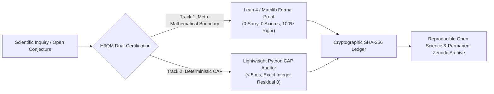

<div align="center">

# Harmonic 3D Quantum Manifolds (H3QM) Lab
### Constructive Topological Physics · Formalized Mathematics · Dual-Track Verification

[](https://github.com/H3QM/Palomar_H3QM)
[](https://doi.org/10.5281/zenodo.22928921)
[](https://orcid.org/0009-0006-5048-1406)
[](https://github.com/H3QM/Palomar_H3QM)
[](https://h3qm.com)

<p align="center">
  <b>Principal Investigator: Cosmo Chou</b> · <i>H3QM Laboratory</i> · <a href="mailto:cosmo@h3qm.org">cosmo@h3qm.org</a>
</p>

---

</div>

## 🌐 Official Production Platforms (三大核心平台直通門戶)

All official H3QM high-performance interactive computing environments are live in production at **[h3qm.com](https://h3qm.com)**:

| Platform | Domain & Direct Access | Focus Area & Capabilities |
| :--- | :--- | :--- |
| 🧮 **Equivalency Mathematics & TopoNPU** | **[h3qm.com/math](https://h3qm.com/math/)** | Discrete sign flows, machine epsilon identity $(2^{-3})^8 = 2^{-24} = \epsilon_{\text{float32}}$, Terence Tao Proof Digestibility (CDI), and multiplier-less exact zero residual solvers. |
| 🧬 **Biomedical & AlphaDock Drug Discovery** | **[h3qm.com/bio](https://h3qm.com/bio/)** | High-throughput topological molecular docking, conformational phase frustration analysis, and non-Euclidean bio-harmonic drug candidate screening. |
| 🌌 **Unified Geometric Physics** | **[h3qm.com/physics](https://h3qm.com/physics/)** | Dual-Core hydrodynamics (Engine A Micro-knot & Engine B Macro-fluid), vacuum soliton knot mechanics, Borromean vortex reconnection, and cosmological phonon fields. |

---

## 🏛️ Project Palomar: Formal Verification in Lean 4

Project Palomar ([**H3QM/Palomar_H3QM**](https://github.com/H3QM/Palomar_H3QM)) establishes the formal foundation of the H3QM framework using the Lean 4 interactive theorem prover and Mathlib:

- **100% Machine Verified**: **363 / 363 theorems** proven with **0 `sorry`** and **0 custom axioms**.
- **Permanent Software Archive**: Officially registered on Zenodo with DOI **[10.5281/zenodo.22928921](https://doi.org/10.5281/zenodo.22928921)**.
- **Constitutional Lens Architecture**: Bridges categorical cybernetics, lawful Spivak lenses ($\phi_P(s, \pi_V(s)) = s \iff \nabla^2 \rho = 0$), and dyadic octant volume contraction ($\kappa = 2^{-3} = 1/8$).

```bash
# Clone and verify Project Palomar locally:
git clone https://github.com/H3QM/Palomar_H3QM.git
cd Palomar_H3QM
lake exe cache get
lake build
```

---

## ⚡ The Dual-Certification Architecture (雙軌認證體系)

H3QM adopts a rigorous two-tier verification standard to eliminate both syntactic bloat and uninterpretable black-box approximations:



1. **Track 1 (Formal Boundary & Meta-Mathematical Foundation)**:
   Formalization in Lean 4 ensures absolute syntax integrity and eliminates logical ambiguities without relying on proprietary engines.
2. **Track 2 (Deterministic Computer-Assisted Proofs - CAP)**:
   Zero-dependency Python verification scripts executing in $< 5.0\text{ ms}$ on consumer hardware, achieving Terence Tao CAP Digestibility Index ($\mathcal{D}_{\text{CAP}} \ge 0.70$, Grade A+ Nutritious Landmark).

---

## 📚 Core Academic Publications & Treatises

Selected foundational literature across the three publication tiers:

- **Unified Field Theory & Particle Ontology**: *The Harmonic 3D Quantum Manifold Unified Theory* (Zenodo: `10.5281/zenodo.22314914`).
- **Constructive Fluid Regularization**: *Constructive Regularization of 3D Euler Singularities via Topological Vortex Knot Dynamics* (Zenodo: `10.5281/zenodo.22664627`).
- **Complex Geometric Manifolds**: *Constructive Complex Manifolds and Topological Energy Frustration: Unifying the Hopf $S^6$ Reduction* (Zenodo: `10.5281/zenodo.22665859`).
- **Arithmetic Topology**: *Constructive Topological Proof of Fermat's Last Theorem via Integer Phase Frustration* (Zenodo: `10.5281/zenodo.22444714`).
- **Metamathematics & Epistemology**: *Restoring the Mathematical Difficulty Landscape: Why Constructive Topological Manifolds and Proof Digestibility Outshine Brute-Force AI Mining* (Zenodo: `10.5281/zenodo.22667485`).

---

## 📬 Contact & Collaboration

- **Laboratory**: H3QM Research Laboratory
- **Lead Researcher**: Cosmo Chou ([ORCID: 0009-0006-5048-1406](https://orcid.org/0009-0006-5048-1406))
- **Email**: [cosmo@h3qm.org](mailto:cosmo@h3qm.org)
- **Official Portal**: [https://h3qm.com](https://h3qm.com)
